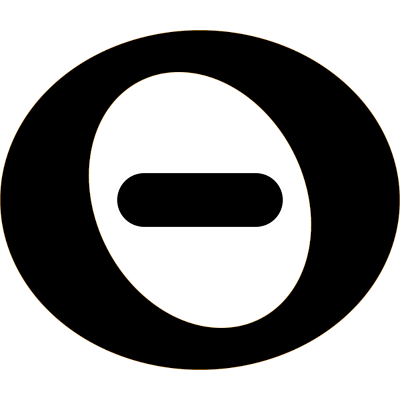

# Edgescript 

Edgescript is a set of programming languages for data analysis and visualization.
It is based on the Uninode core library. 

It is primarily used in the Nodelab product, used for data integration and visualization, 
but can be used for any project that requires dynamic behavior.
